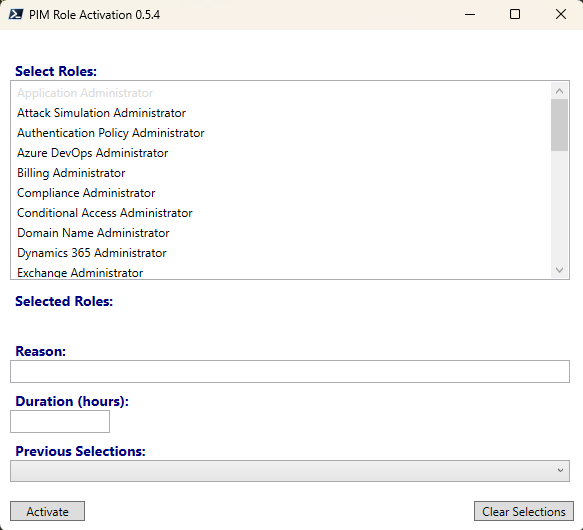
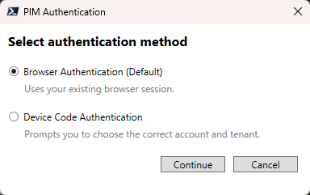
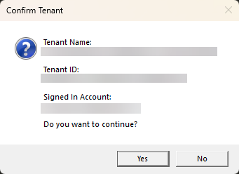

# PIM Role Activation

**Current Stable Release:** 0.5.4

## Overview

PIM Role Activation provides a graphical interface for activating Microsoft Entra Privileged Identity Management (PIM) roles.

The script discovers the PIM roles available for activation by the signed in user and presents them in an easy-to-use interface.

Users can:

- Select one or more eligible PIM roles
- Provide an activation reason
- Specify an activation duration
- Reuse previous role activation selections
- Activate multiple PIM roles in a single operation
- Select their preferred authentication method

---

## Features

### Role Selection

The main interface displays all eligible PIM roles available to the signed-in account.

Roles that are already active are automatically disabled and displayed as greyed out to prevent duplicate activation requests.



### Role Activation

Select one or more roles and provide:

- Reason
- Duration (hours)

Click **Activate** to submit activation requests.

The requested duration is automatically validated against the maximum duration permitted by the role assignment policy.

If the requested duration exceeds the permitted duration, the script automatically adjusts the request to the maximum allowed value.

---

### Authentication Method Selection

Version 0.5.4 introduces support for multiple authentication methods.

When the script starts, users are prompted to choose how they would like to authenticate.

#### Browser Authentication (Default)

Uses the existing browser sign-in experience.

Advantages:

- Fastest authentication experience
- Uses existing browser sessions
- Recommended for most users

#### Device Code Authentication

Uses Microsoft device code authentication.

Advantages:

- Allows explicit account selection
- Allows explicit tenant selection
- Useful when managing multiple tenants
- Useful when browser authentication signs into the wrong account



---

### Tenant Confirmation

After successful authentication, the script displays the tenant and account information retrieved from Microsoft Graph.

Users must explicitly confirm:

- Tenant Name
- Tenant ID
- Signed In Account

before continuing.

This helps prevent accidental activation of privileged roles in the wrong tenant.



---

### Previous Selections

The script maintains a history of previous activations.

History is stored at:

```text
$env:USERPROFILE\Documents\PIMRoleSelections.json
```

When a previous selection is chosen from the **Previous Selections** drop-down:

- Selected roles are restored
- Activation reason is restored
- Activation duration is restored

This allows commonly used role combinations to be reactivated quickly.

---

### Clear Selections

The **Clear Selections** button resets:

- Selected roles
- Activation reason
- Duration
- Previous selection values

without restarting the application.

---

## Requirements

### PowerShell

PowerShell 7.x is recommended.

Verify version:

```powershell
$PSVersionTable.PSVersion
```

### Microsoft Graph PowerShell SDK

Install Microsoft Graph:

```powershell
Install-Module Microsoft.Graph -Scope CurrentUser
```

### Required Microsoft Graph Permissions

The script requires:

```text
RoleManagement.Read.Directory
RoleManagement.ReadWrite.Directory
User.Read
```

### Internet Connectivity

Internet connectivity is required to connect to Microsoft Graph.

### Script Execution Policy

The execution policy must allow PowerShell scripts to run.

Example:

```powershell
Set-ExecutionPolicy RemoteSigned -Scope CurrentUser
```

---

## Authentication Notes

### Browser Authentication

Uses:

```powershell
Connect-MgGraph
```

Recommended for:

- Day-to-day administration
- Single tenant environments
- Users who have an active browser session

### Device Code Authentication

Uses:

```powershell
Connect-MgGraph -UseDeviceCode
```

Recommended for:

- Multi-tenant administrators
- Shared administration workstations
- Situations where browser authentication selects the incorrect account

Device Code authentication also disables Windows Authentication Manager (WAM) to provide a consistent sign-in experience.

---

## Troubleshooting

### Authentication succeeds but Graph commands fail

Disconnect from Microsoft Graph and reconnect:

```powershell
Disconnect-MgGraph
```

Then relaunch the script.

### Incorrect Account Selected

Choose:

```text
Device Code Authentication
```

during startup.

Device Code authentication allows you to explicitly select the intended account and tenant.

### Missing Roles

Verify that:

- The account has eligible PIM assignments
- The account is authenticated to the correct tenant
- Microsoft Graph consent has been granted

---

## Acknowledgements

The loading screen implementation uses functionality provided by:

Mentaleak (Zachary Fischer)

GitHub Repository:

https://github.com/VitalProject/Show-LoadingScreen

## Version History

### 0.5.4
- Added Browser Authentication option
- Added Device Code Authentication option
- Added tenant confirmation dialog
- Added account confirmation display
- Improved Microsoft Graph authentication handling
- Added Process-scoped Graph connections

### 0.5.3
- Added activation history
- Added previous selections support
- Added loading screen